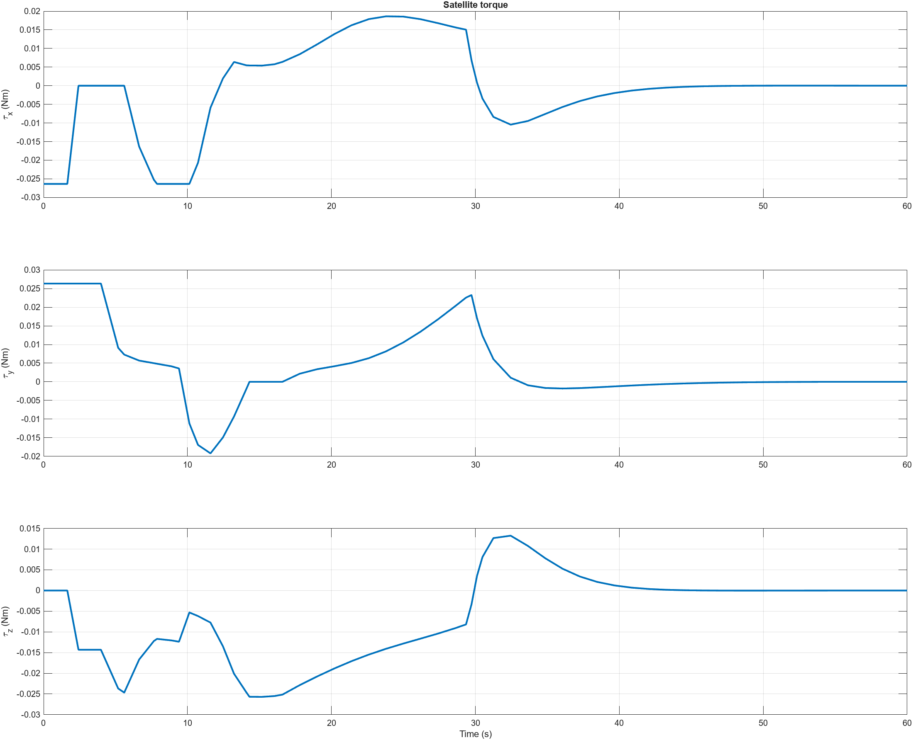
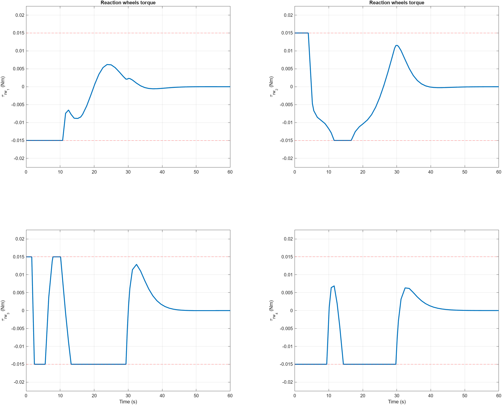
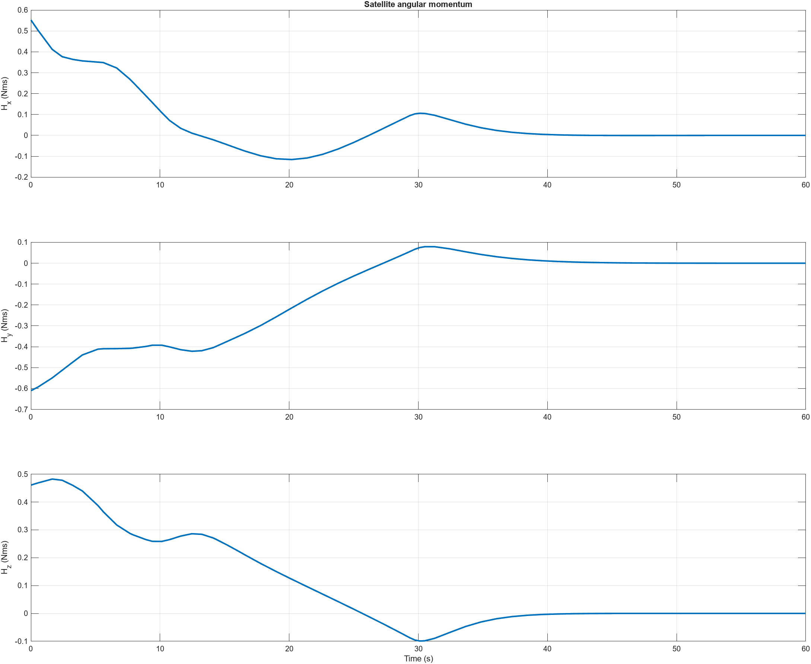
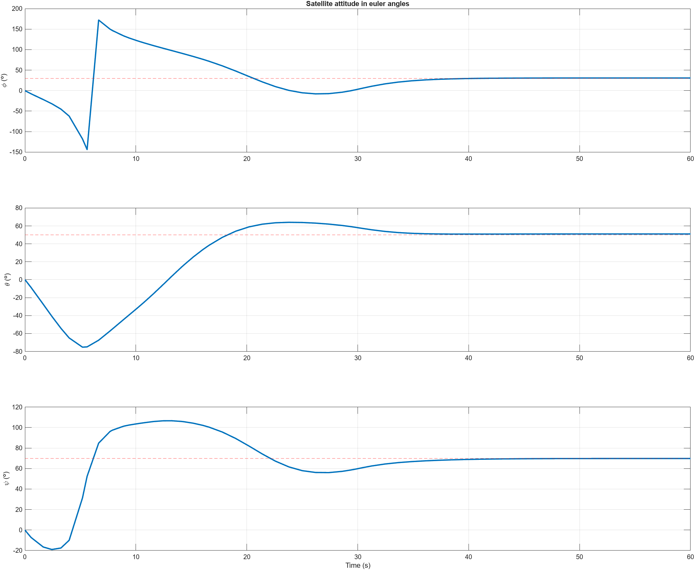

# Satellite Attitude Control System

## Description

This MATLAB/Simulink project implements a 3DOF reaction wheel-based Attitude and Orbit Control System (AOCS) for satellite attitude control. Utilizing quaternion representation for attitude kinematics, the system employs PD control for precise attitude tracking. It includes modeling of satellite rotational dynamics and pyramidal reaction wheels configuration. This project is designed for aerospace engineers seeking practical applications of control theory in spacecraft systems.

## Features

- **3DOF Control**: Implements three degrees of freedom control using reaction wheels.
- **Quaternion Representation**: Utilizes quaternion for attitude kinematics.
- **PD Control**: Employs proportional-derivative control for attitude tracking.
- **Simulation**: Includes detailed simulation of satellite dynamics and control.

## Project Structure

- **reaction_wheel.m**: Main MATLAB script that sets up the parameters, runs the simulation, and generates plots.
- **reaction_wheel_model.slx**: Simulink model file for the AOCS.

## Running the Project

1. Open MATLAB and navigate to the project directory.
2. Run the main script:

    ```matlab
    reaction_wheel.m
    ```

3. View the simulation results in the generated plots.

## Simulation Results

### Satellite Torque



### Reaction Wheels Torque



### Satellite Angular Momentum



### Satellite Angular Rate


### Satellite Attitude in Quaternion


### Satellite Attitude in Euler Angles



## Documentation

For more detailed information, please refer to the following documents:

- [Reference PDF: Optimization of pyramidal reaction wheel configuration for minimizing angular momentum](Docs/Reference.pdf)
- [Detailed Documentation PDF](Docs/Documentation.pdf)

## Author

Yuvannithi Thirumaran

## License

This project is licensed under the MIT License - see the [LICENSE](LICENSE) file for details.
